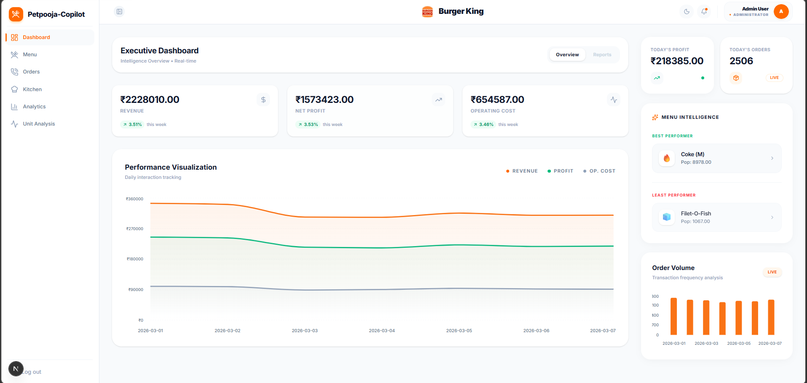
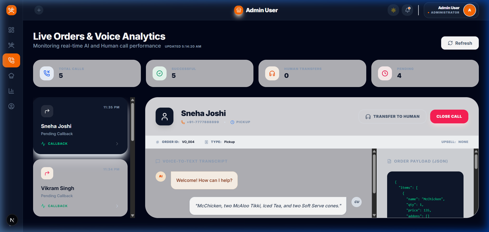
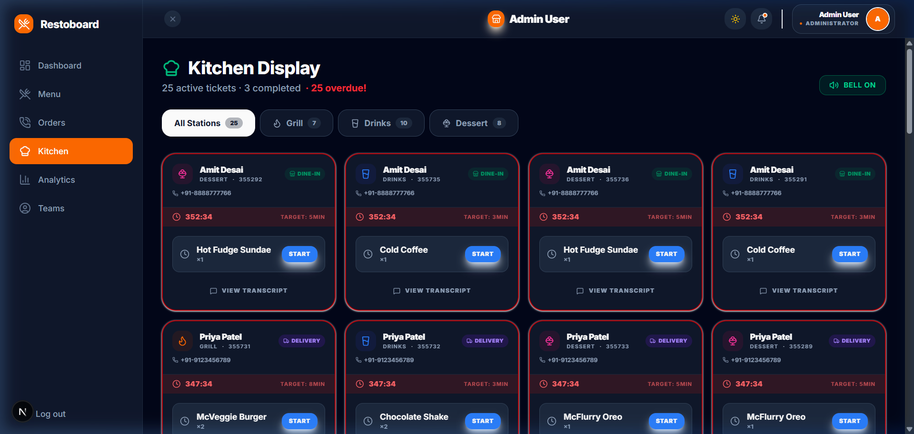

<div align="center">
  
  <h1>🍔 Petpooja-Copilot</h1>
  <p><em>An intelligent, real-time Voice AI & Kitchen Display operational dashboard built for modern restaurants.</em></p>

  <p>
    
    
    
    
    
  </p>
</div>

---

## � Dashboard Previews

<div align="center">
  
  
  
</div>

---

## �🚀 Features at a Glance

* **🎙️ Live Voice Orders:** Monitor incoming AI calls, view live customer-AI transcripts, and track success/failure rates.
* **👨‍🍳 Real-Time KOT System:** Kitchen Order Tickets automatically sync to specific stations (e.g. Grill, Drinks) with dynamic SLA countdown timers.
* **📊 Dashboard Analytics:** Visualize your daily revenue targets, recent order volumes, and system-wide performance scores instantly.
* **🎯 Unit Profitability Analysis:** Automatically identify your menu's **Stars**, **Workhorses**, **Challenges**, and **Dogs** to maximize long-term margin.
* **🔐 Role-Based Routing:** Seamlessly redirect Admins to configuration dashboards, while locking Kitchen Staff purely to the Kitchen Display screen.

---

## 🏗️ System Architecture

* **Client**: Next.js App Router serving both the Web Dashboard and Kitchen Display interfaces.
* **Authentication**: NextAuth.js validating secure sessions and enforcing strict Role-Based Access Control.
* **Backend APIs**: Built-in Next.js REST API routes (`/api/*`) handling business logic and external webhooks.
* **Database**: MongoDB paired with Mongoose managing schemas, complex queries, and live operational data.
* **External Integrations**: Voice AI callers interacting with the server via structured webhook triggers.

---

## 🔌 API Reference

The core application exposes the following internal endpoints for the dashboard and external AI webhooks:

| Endpoint           | Supported Methods                  | Description                                                                 |
| :---               | :---                               | :---                                                                        |
| `/api/menu`        | `GET`, `POST`, `PUT`, `DELETE`     | Retrieve and manage restaurant menu items, categories, and availability.  |
| `/api/kot`         | `GET`, `PUT`                       | Fetch live Kitchen Order Tickets and update station preparation statuses. |
| `/api/orders`      | `GET`                              | Query finalized daily orders, revenue metrics, and items sold.              |
| `/api/transcripts` | `GET`                              | Access live customer-to-AI voice call conversation logs.                    |

---

## 🛠️ Technology Stack

| Role            | Technology                               | Link / Purpose                                                                       |
| :---            | :---                                     | :---                                                                                 |
| **Core**        | [Next.js App Router](https://nextjs.org) | SSR, Routing, and Turbopack compiler.                                                |
| **Styling**     | [Tailwind CSS](https://tailwindcss.com/) | rapid, customizable utility classes.                                                 |
| **UI Components**| [shadcn/ui](https://ui.shadcn.com/)      | Radix Primitives + Tailwind Merge.                                                   |
| **Database**    | [Mongoose](https://mongoosejs.com/)      | MongoDB driver handling Models, Webhooks, and KOT generation triggers.               |
| **Charts**      | [Recharts](https://recharts.org/)        | D3.js based customizable analytics dashboards.                                       |

---

## ⚙️ Quick Start Installation

### 1️⃣ Clone and Install
First, navigate into the project directory and install the required dependencies:

```bash
cd petpooja
npm install
```

### 2️⃣ Environment Variables
Create a `.env` file in the root of the project (next to `package.json`). Below is the required configuration template:

```env
# URL for NextAuth configuration (Required for Google Auth redirects)
NEXTAUTH_URL=http://localhost:3000

# Strong random string to encrypt user session cookies (e.g. generated via `openssl rand -base64 32`)
NEXTAUTH_SECRET=<your_strong_random_secret_string>

# Primary Database Connection
MONGODB_URI=<your_primary_mongodb_connection_string>

# Google Cloud OAuth 2.0 Credentials
GOOGLE_CLIENT_ID=<your_google_oauth_client_id>
GOOGLE_CLIENT_SECRET=<your_google_oauth_client_secret>

# Environment indicator
NODE_ENV=development
```
> **💡 Tip:** The application automatically connects to a secondary `petpooja_db` instance extracted from your primary connection string to parse external Voice AI webhooks. 

### 3️⃣ Start the Dashboard
To start the Next.js server with Turbopack enabled:

```bash
npm run dev
```

You can now hit **`http://localhost:3000`** in your browser!

---

## 🔑 Authentication Access

The application utilizes **NextAuth.js**. A user must be authenticated to access the dashboard.

### 🌐 Live Demo
You can try the live application here: **[https://petpooja-intel.vercel.app](https://petpooja-intel.vercel.app)**

### 🛡️ Role-Based Access Control (RBAC) Matrix

| Feature / Route        | 👑 Administrator | 👨‍🍳 Kitchen Staff |
| :---                   | :---:            | :---:              |
| **Dashboard Home**     | ✅               | ❌ *(Redirected)*  |
| **Menu & Pricing**     | ✅               | ❌ *(Redirected)*  |
| **Analytics Engine**   | ✅               | ❌ *(Redirected)*  |
| **Live Voice Orders**  | ✅               | ❌ *(Redirected)*  |
| **Kitchen Display**    | ✅               | ✅                 |

If you are exploring the live demo or developing locally and need to test specific Role-Based access, use the following credentials:

### 👑 Administrator Account
*Access: Full access to Dashboard, Menu Editing, Analytics, and Live Transcripts.*
- **Email:** `admin@petpooja.com`
- **Password:** `admin123`

### 👨‍🍳 Kitchen Staff Account
*Access: Restricted specifically to the Kitchen Display panel to view live KOTs. All other routes bounce back to `/kitchen`.*
- **Email:** `staff@petpooja.com`
- **Password:** `staff123`

---

<p align="center">
  Built securely bridging modern Voice AI agents into native restaurant Kitchen Display systems.
</p>
